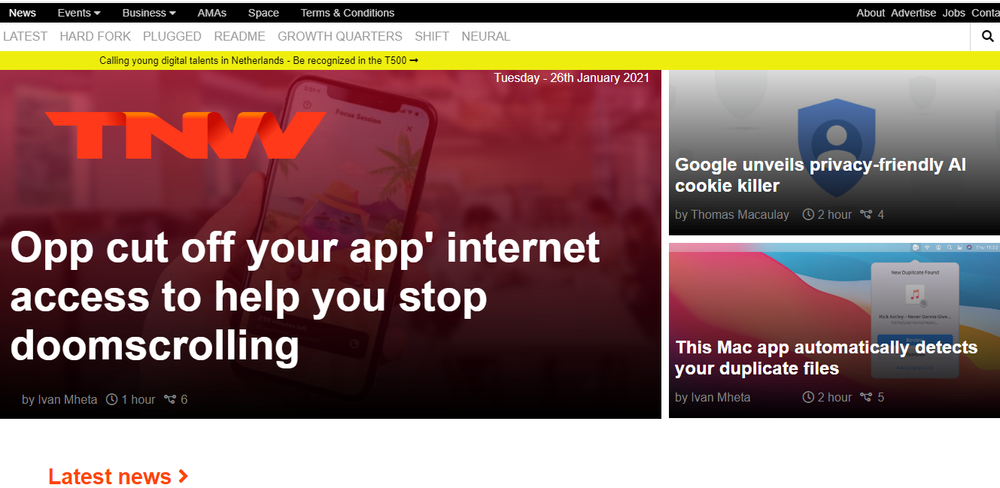

# The Next Web Page Clone

This page is a clone of The Next Web page. In this project I applied float,
 flexbox, grid and position, and made the page fully Responsive on Mobile phone,Tablet and Computer screens

## Built With

- HTML
- CSS

## Live Demo

[Live Demo Link](https://henryhaulka.github.io/The_Next_web_page/)

## Getting Started

**To visit the page go to the live demo link**

### Pre-requisites

1. An internet browser
2. A computer,A Mobile phone, A Tablet.

## Authors

👤 Onu Henry Chibuike

- Github: [@Henryhaulka](https://github.com/Henryhaulka)
- Twitter: [@ONUHENRY12](https://twitter.com/ONUHENRY12)
- Linkedin: [Henry Onu](https://www.linkedin.com/in/henry-onu-9a15b11b6/)

👤 Author Stephanie Sakuhuni
- GitHub: @stephanie041996
- LinkedIn: [linkedin](https://www.linkedin.com/in/stephanie-sakuhuni-a81029140/)

## 🤝 Contributing

Contributions, issues and feature requests are welcome!

Feel free to check the [issues page](https://github.com/Henryhaulka/The_Next_web_page/issues).

## Show your support

Give a ⭐️ if you like this project!

## Acknowledgments

Thanks to The Next Web for inspiring us.

## 📝 License

This project is [MIT](lic.url) licensed.
